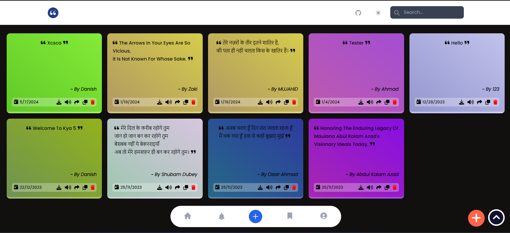

# YourQuotes-App 📱

"YourQuotes" is a visually stunning and user-friendly application built with Vite+React. It offers a seamless experience for users to post their favorite quotes, ensuring a streamlined process. Users can effortlessly share quotes with friends, copy them to the clipboard, or download them as gradient images. The app also includes essential features such as a Home feed, Notifications, Bookmarks, and Profile management. Additionally, users can interact with quotes using Like buttons and have the option to edit their own submissions. Exciting features like "Quotes of the Day" provide daily inspiration, while translation capabilities enhance accessibility for a global audience. With its intuitive interface and a myriad of features, YourQuotes is the ultimate destination for quote enthusiasts to engage, express, and inspire. Join us in the journey of sharing wisdom and inspiration with YourQuotes.

[](https://app.netlify.com/sites/your-quotess/deploys)
<a href="https://github.com/danishzayan/YourQuotes-App"></a>
<a href="https://github.com/danishzayan/YourQuotes-App/stargazers"></a>
[](https://GitHub.com/danishzayan/YourQuotes-App/graphs/contributors/)
<a href="https://github.com/danishzayan/YourQuotes-App/network/members"></a>
[](https://github.com/danishzayan/YourQuotes-App/commit/)
[](https://GitHub.com/danishzayan/YourQuotes-App/issues/)
[](https://GitHub.com/danishzayan/YourQuotes-App/issues?q=is%3Aissue+is%3Aclosed)
<a href="https://your-quotess.netlify.app/"></a>
<a href="https://www.linkedin.com/in/danishzayan/"></a>

## Screenshot of App 📷



## Run YourQuotes-App

```bash
npm install
```

```bash
npm run dev
```

# 📜 Quotes Application UI Features

This application allows users to post, search, listen to, share, copy, download, and manage quotes with ease. Below is a detailed list of features to help contributors understand the current functionality and areas that need further development.

## ✅ Completed Features

- **Quotes Posting** ➕
  - Users can post new quotes by clicking on the plus icon (`+`) at the bottom right corner.
- **Search Functionality** 🔍
  - A search bar at the top allows users to search for quotes.
- **Listening to Quotes** 🔊
  - Users can listen to quotes using the text-to-speech feature.
- **Sharing Quotes** 📤
  - Users can share quotes via a share button.
- **Copying Quotes** 📋
  - Users can copy quotes to the clipboard.
- **Downloading Quotes** 📥
  - Users can download quotes.
- **Dark Mode** 🌙
  - Users can toggle between dark mode and light mode.

## 🚧 Pending Features

- **Pages** 📄
  - Home
  - Notification
  - Add
  - Bookmark
  - Profile
- **Edit Quotes** ✏️
  - Implement functionality for users to edit existing quotes.
- **User Authentication** 🔐
  - Add user login and registration features to personalize the experience.
- **Commenting on Quotes** 💬
  - Allow users to add comments on individual quotes.
- **Like Button** 👍
  - Implement a feature to allow users to like quotes.
- **Favorites/Bookmarks** 📑
  - Allow users to mark quotes as favorites or bookmark them for later reference.
- **Profile Management** 👤
  - Add user profile management to track posted quotes and activities.
- **Quote Categories/Tags** 🏷️
  - Enable categorizing or tagging quotes for better organization and searchability.
- **Quote Translations** 🌐
  - Provide a feature to translate quotes into different languages.
- **Notification System** 🔔
  - Implement notifications for user activities and updates.
- **Social Sharing** 🌐
  - Allow users to share quotes on social media platforms.
- **Quote of the Day** 🌅
  - Feature a "Quote of the Day" on the homepage.
  <!-- - **Advanced Search Filters** 🔍
  - Add advanced search filters to refine search results. -->
- **Analytics Dashboard** 📊
  - Provide an analytics dashboard for users to see their quote interactions in profile.
- **User Follow System** ➕👤
  - Allow users to follow other users and see their activity.
- **Multimedia Quotes** 🎨
  - Enable users to add images or videos to quotes.
- **Quote Collections** 📚
  - Allow users to create and share collections of quotes.
- **Offline Mode** 📴
  - Provide an offline mode to access quotes without an internet connection.
- **Localization** 🌍
  - Support multiple languages for the application interface.

## Contributing 👨‍💻

[](https://github.com/ellerbrock/open-source-badges/)

- Contributions make the open source community such an amazing place to learn, inspire, and create.
- Any contributions you make are **greatly appreciated**.
- Check out our [contribution guidelines](/CONTRIBUTING.md) for more information.

## License 🛡️

YourQuotes-App is licensed under the MIT License - see the [LICENSE](LICENSE) file for details.

## Contributor Over Time ⏳

[](https://www.apiseven.com/en/contributor-graph?chart=contributorOverTime&repo=danishzayan/YourQuotes-App)
<br />

## Project Contributors 🌟

Thanks a lot for spending your time helping YourQuotes grow. Thanks a lot! Keep rocking 🎉 </p><br />

<a href="https://github.com/danishzayan/YourQuotes-App/graphs/contributors">
  
</a>

<hr>
<p align="center">
  Made in :heart: INDIA and ⭐ Staring the repo..
</p>
